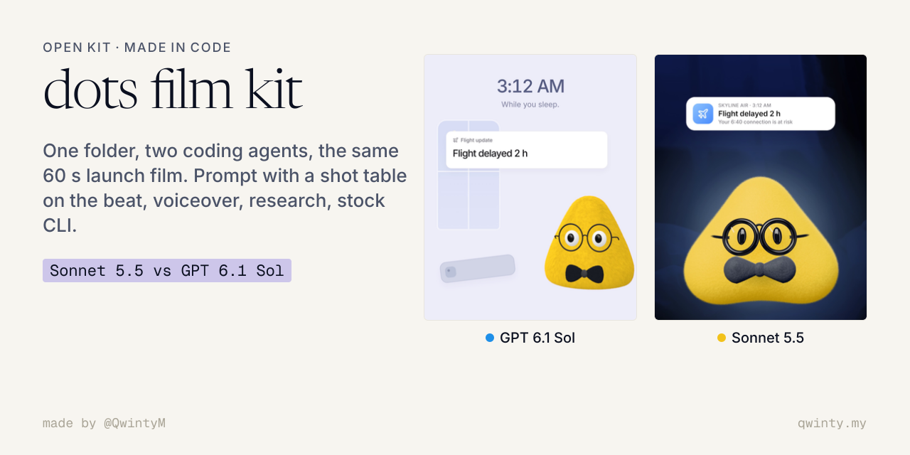
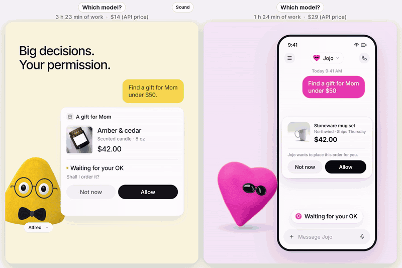
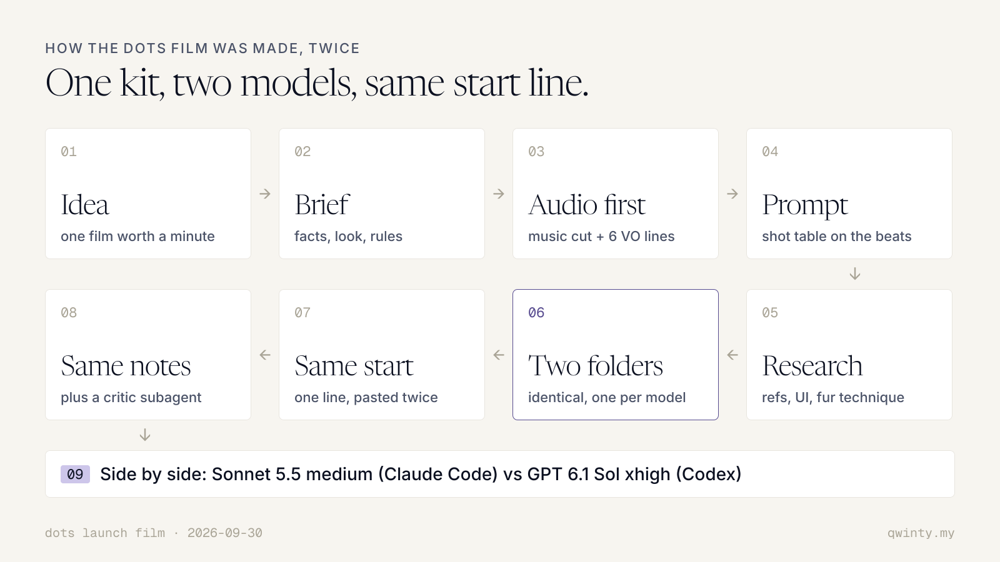
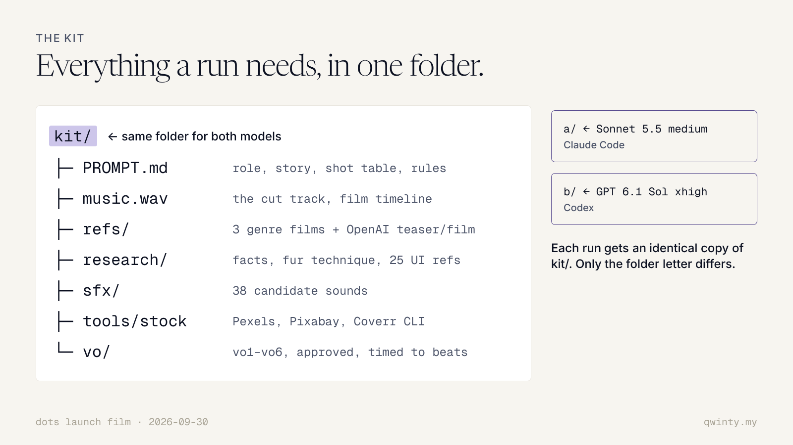
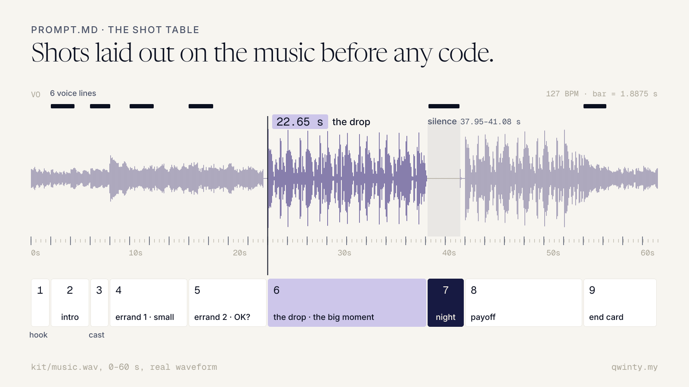
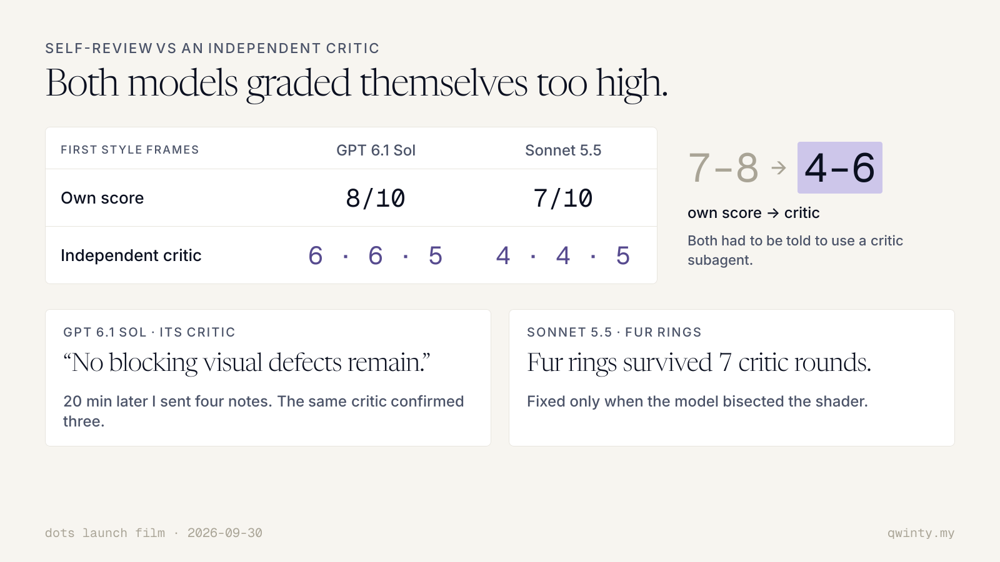
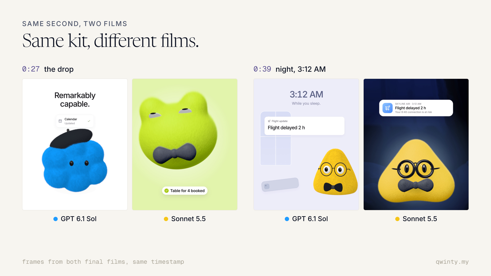

  
  
  
  

# dots film kit

The starting folder I gave two coding agents to make the same 60 s launch film for OpenAI's dots: one run with
Sonnet 5.5 (medium) in Claude Code, one with GPT 6.1 Sol (xhigh) in Codex. Same prompt, same track, same voiceover,
same start line. The result is in this X post: https://x.com/QwintyM/status/2105314602322174143

People asked how it was set up, so this is the folder as both runs got it, minus the files I can't share (see
[What's not included](#whats-not-included)), plus what happened around it.

## Feed it to your agent

1. Clone this repo twice, one folder per model (I used `dots-a` and `dots-b`; the prompt reads the letter from the
   folder name).
2. Add what the repo can't ship: your own `music.wav` (60 s or longer), SFX under the names in `sfx/README.md`, the
   reference videos from the links in `refs/README.md`, and `.env` from `.env.example` if you want stock photos.
3. Open the agent in each folder and paste the same line. This is the exact line both runs got:

> Read `PROMPT.md` in this folder and make the film it describes, from "## Role" to the end, in the current folder.
> Stop and ask me before anything that goes public.

The prompt also tells the agent to read a skill of mine, `seekable-motion` (a frame-by-frame render harness for
Playwright). It isn't in this repo. Without it the agent has to build its own
seek-and-capture loop, which both models can do.

The music section and the shot table are timed to my track (drop at 22.65 s, silence at 37.95–41.08 s). With a
different track, re-time them first, or the agent will cut to beats that aren't there.

## How it went

All of this happened on 2026-09-30, the day after dots was announced. The run times below are Moscow time.

1. **Idea.** A launch film for dots made in code, by two models from one prompt, to compare them. I picked a
   straight 60 s launch ad, 4:5, in the official pastel 3D look, with a small "Unofficial ad" line. Why: the joke is
   the post around the film, so the film itself should be a real attempt.

2. **Brief.** Before any prompt I wrote down the decisions: format, length, style, what's allowed (stock photos,
   people, subagents). Why: the prompt was rewritten several times that morning, and the brief kept the decisions
   from drifting between versions.

3. **Audio fixed first.** The film is cut to sound, so the sound was finished before either run started.
   - Music: a track from Artlist, "skeptical" by messwave (instrumental), ~127 BPM, one bar = 1.8875 s. Its drop at
     30.4 s was too late for a feed, so the first 4 bars were cut (the file starts 7.72 s into the original). In the
     cut, the drop lands at 22.65 s, full silence runs 37.95–41.08 s and the beat returns at 41.55 s. The film uses
     0–60 s with a fade at 57.5–60 s.
   - Voiceover: six lines generated once with Gemini TTS (`gemini-3.8-flash-tts`, voice Sulafat, picked from an
     audition of 4 voices). Each take was checked word for word with Deepgram Nova-3. The files are in `vo/`, with
     their start times in `vo/README.md`.
   - Both runs got the same files. Why: if each model made its own audio, the films would differ on sound before
     they differed on picture.

4. **Prompt with a shot table on the beat grid.** `PROMPT.md` has 9 shots, each placed on the track: the errands on
   the groove, every character bursting in on the first frame of the drop, the night errand inside the 3 s silence,
   morning light on the beat's return, the end card as the music settles. Why: with fixed beats both films land the
   same moments at the same second, so they can play side by side.

   

5. **Research handed to both.** `research/` has the product facts with sources, a technique guide for plush fur in
   three.js, and notes on how OpenAI shows its UI (flat phones, never a 3D mockup). The guide found that Playwright's
   headless Chromium renders WebGL on the CPU by default, so the prompt tells the agent how to check it's on the GPU.
   Why: neither model has to spend its run looking things up, and both start from the same facts.

6. **Identical folders.** Folder A was re-created as a byte-for-byte copy of folder B after the prompt changed, and
   later changes were copied into both and checked with `diff`. Why: a fair comparison needs the same input.

7. **Same start line.** Both runs started at 09:53 with the line above.

8. **Same notes during the run.** I watched both runs and sent notes. The ones that went to both:
   - **Use a critic subagent.** Both models rated their first style frames 7–8/10 on their own. An independent critic
     subagent gave them 4–6. I had to tell both to use one.
   - **Lucide icons.** Without the note, both drew their own icons.
   - **Real photos in the UI** instead of drawn product cards (both pulled stock photos through `tools/`).
   - **iOS-style spring motion** for the UI.
   - **The wordmark was clipped.** Both cut off part of the letters of "dots".
   - **Bodies intersecting.** In both films the characters passed through each other.

   Sonnet also got notes the other run didn't need or didn't get: a 375×812 phone, blinks that close faster than they
   open, a cursor that disappeared on a dark button, and characters jumping position in one frame at 45–49 s. Sol
   also got "the background isn't white".

   One more thing: when the official page images turned up mid-run, the prompt changed to bright, saturated fur. Both
   runs got the same message about it.

   Why the same notes: a note fixes a film, so a note only one model gets is an advantage.

   

9. **Collection and side by side.** The films came back as `dots-a.mp4` and `dots-b.mp4`. I built the comparison as
   two films next to each other at the same second, with each run's active time and API price on top, and the model
   names revealed at 56.6 s.

   

The numbers, counted from the session logs:

| | Sonnet 5.5 medium (Claude Code) | GPT 6.1 Sol xhigh (Codex) |
|---|---|---|
| Active time (no waiting for me; renders as below) | 1 h 24 min, plus ~110 min blocked on full renders | 3 h 23 min, renders ran in the background while it worked (lower bound without them: 2 h 45 min) |
| Tokens | 85.69 M | 51.97 M (94% cached) |
| API cost | $29.06 | $13.74 |
| Builds of the film | 8 | 1 draft + 3 finals |

Caveats: one run per model and one judge (me). Both runs hit their plan limits mid-way, and Sol's last round of fixes
ran on effort high, not xhigh.

## What's in here

| path | what |
|---|---|
| `PROMPT.md` | the prompt both runs got |
| `vo/` | the six voiceover lines (Gemini TTS) and their timings |
| `research/` | product facts, the fur technique guide, notes on phones and UI; READMEs for the image folders |
| `refs/README.md` | what each reference film does, with links |
| `sfx/README.md` | the 38 SFX files both runs got: names, roles, levels, source library |
| `tools/` | `stock/stock.mjs`, a small Node 18+ CLI with no dependencies: search Pexels, Pixabay and Coverr, get a numbered contact sheet, download with checks and log each file to `assets/manifest.jsonl` |
| `.env.example` | the keys `stock.mjs` and Freesound need |

## What's not included

| what | why |
|---|---|
| `music.wav`, `music-src.aac` | licensed from Artlist. Get "skeptical" by messwave (instrumental) there and cut it as in step 3, or use your own track |
| `sfx/*.wav`, `sfx/*.mp3` | from my licensed SFX libraries. The README lists what each was for |
| `vo/guide-mix.wav` | the approved guide mix, but it contains the music |
| `refs/*.mp4` | third-party films (Meta, xAI, Krea, OpenAI). Links in `refs/README.md` |
| `research/official-frames/`, `official-page/`, `ui-refs/` images | OpenAI's frames and images, and other people's screenshots. The READMEs keep the sources and our notes |
| `.env` | my API keys |

## Edits to the original files

- `PROMPT.md`: four absolute paths on my machine are replaced with `...\dots-a\`, `<socials>\...` and `<path-to>\...`
  (lines 4, 11, 281, 335). Nothing else changed. It still mentions files that aren't shipped (the music, the refs,
  the guide mix) because that's what the runs got.
- `tools/README.md`: one absolute path to my Apify script replaced with `<path-to>/...`. The Pinterest step needs my
  Apify skill, which isn't in this repo.
- The READMEs in `refs/`, `sfx/`, `vo/`, `research/official-page/` and `research/ui-refs/` got a short note on top
  saying what's missing. `research/official-frames/README.md` is new.

## License

MIT for my code and text (the prompt, the READMEs, the research notes, `tools/`, the voiceover files): see
[LICENSE](LICENSE). The third-party media the runs used (music, SFX, reference films, screenshots) are not in this
repo and are not covered by it. dots and the dots characters belong to OpenAI. This kit is not affiliated with OpenAI.

---

Made by Maxim, [@QwintyM](https://x.com/QwintyM) on X · [qwinty.my](https://qwinty.my). I make films in code with AI agents and compare the models. If you run this kit with another model, tag me, I'd like to see it.
